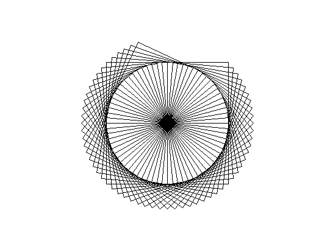
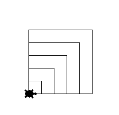
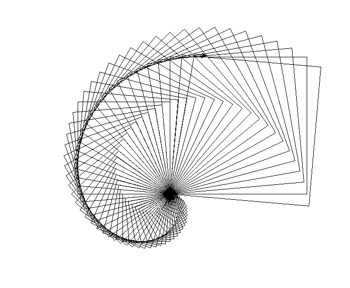

## Loops in Python
Every programming language has a way to repeat code. Python offers us 'for' loops to repeat a sequence of code.
```python
for i in range(3):
    print(i)
```
In this code sequence we run the following print function once for each iterable in the range 3. Picture it this way,  there are 3 numbers, 0, 1, and 2. "For" each number OR iterable(i) in that list of numbers (0,1,2), we will print the number in the terminal. 

Let's use this logic to create a square in Python. We will begin by writing out the commands with pseudo-code. 

1. Create Loop with range 4
2. move the turtle forward
3. rotate turtle left
4. repeat loop

In terms of Python the code will look like this
```Python
for i in range(4):
    t.forward(100)
    t.left(90)
```

Logically the loop operates as follows

1. i is 0 and we execute forward(100) followed by left(90) increase value of i by 1
2. i is 1 and we execute forward(100) followed by left(90) increase value of i by 1
3. i is 2 and we execute forward(100) followed by left(90) increase value of i by 1
4. i is 3 and we execute forward(100) followed by left(90) increase value of i by 1

## Refactor and Challenges
1. Refactor the previous loop to use a function called "Square"
2. Create a new function that uses a loop to create a triangle
3. Write a function that draws 60 squares, turning righjt 5 degrees after each square. 

The result should look as follows



# Variables 

We can make our functions more dynamic by allowing them to accept "arguments" or "parameters". We can create a variable called "length" and assign a value to the variable.
```Python
sidelength = 100
rotate = 90
def square(x,y):
    for i in range(4):
        t.forward(x)
        t.left(y)
triangle(100,90)
```


#  Manipulating Variables 

We can manipulate variable values by using math operations. 
Let's try creating squares that double in size everytime throught the loop  using
```python
def doubleSquares(iRange):
    length = 25
    for i in range(iRange):
        square(length, 90)
        length = length * 2
doubleSquares(5)

```
The output should be 5 squares doubling in size from the previous square. 

We can also increase with addition or subtraction in a more succinct way
```python
def addSquares(iRange):
    length = 25
    for i in range(iRange):
        square(length, 90)
        length += 25
addSquares(5)
```



## Assesment

1.Make a function to draw 60 squares, turning 5 degress after each square and making each successive square bigger. Start at length 5 and increment 5 units every square. 
def draw_Square(iRange):



2. Create a function that will draw a 5 pointed star using the angle 144. Then create a function that draw a spiral of stars that looks as follows
   
